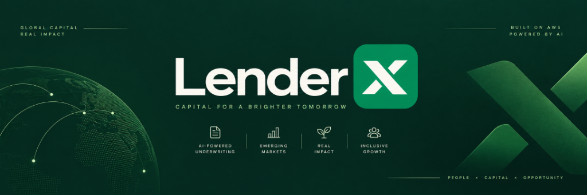
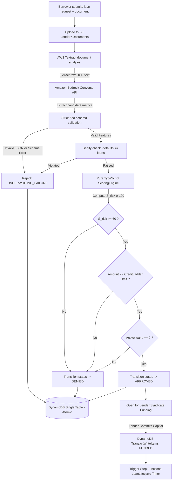
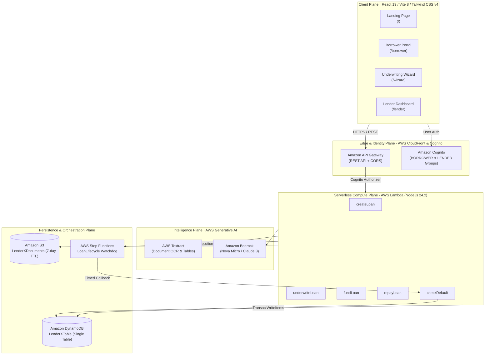

<p align="center">
  
</p>

<div align="center">

# LenderX — Autonomous AI Micro-Credit & Regenerative Capital Platform

**Serverless Micro-Credit Infrastructure & Real-Time Underwriting**

<a href="https://skillicons.dev">
  
</a>

</div>

LenderX bridges low-yield global capital with high-velocity, capital-starved emerging market MSMEs and smallholder agricultural producers. By replacing sluggish manual loan committees with **Amazon Bedrock generative underwriting**, **AWS Textract document telemetry**, and a **deterministic multi-factor risk scoring engine**, LenderX evaluates uncollateralized working-capital requests in sub-second latency while enforcing strict mathematical risk guardrails.

The core architecture follows a strict, non-bypassable execution pipeline:

> **Document Ingestion (S3) → AWS Textract OCR & Telemetry → Amazon Bedrock Underwriting (Nova / Claude) → Deterministic Scoring Engine → Credit Ladder Guardrails → DynamoDB Atomic State Machine → Lender Syndication**
>
> The generative AI model is strictly advisory: it parses informal receipts, harvest manifests, and bank statements into standardized features, but never computes risk scores, never overrides credit ceilings, and never touches ledger balances.

---

## Why It Exists

In emerging markets, over **70% of micro-enterprises and smallholder farmers are excluded from formal banking** due to a lack of traditional credit bureau scores and audited financial statements. When urgent capital is needed for seasonal seeds, fertilizer, or inventory restocking, merchants face predatory local lenders charging **40% to 120% APR**. Conversely, global institutional and retail impact capital sits in mature markets yielding sub-5% returns.

Traditional financial institutions fail here because underwriting a $150 micro-loan costs virtually the same in human labor as a $50,000 commercial loan — making small-ticket lending economically impossible.

LenderX solves this structural inefficiency through an autonomous serverless architecture:

- **Alternative Document Telemetry** — Ingests informal hand-written ledgers, point-of-sale exports, harvest weight receipts, and mobile-money statements via **AWS Textract**.
- **Generative Financial Synthesis** — Uses **Amazon Bedrock** (`amazon.nova-micro-v1:0` / Claude 3) to extract structured financial features and anomaly flags from noisy, unstructured documents.
- **Deterministic Multi-Factor Scoring** — Mathematical risk formulation ($S_{\text{risk}} \in [0, 100]$) evaluated by pure TypeScript domain engines with zero external dependencies.
- **Progressive Credit Ladder** — Borrowers start with safe micro-limits ($50) and progressively unlock up to $5,000 across 7 tiers through verified on-time repayment cycles.
- **Double-Entry Atomic Isolation** — All balance deductions, disbursements, and repayments execute in single atomic transactions via **Amazon DynamoDB `TransactWriteItems`** with integer-cent precision.
- **Autonomous Term Surveillance** — **AWS Step Functions** orchestrates post-disbursement lifecycle monitoring, triggering automated default evaluations and credit tier adjustments upon term expiration.

---

## Deterministic Risk Engine & Credit Ladder

LenderX refuses to allow generative AI models to make hallucinated credit approvals. Instead, Bedrock outputs structured financial metrics that are strictly parsed and passed into a **pure mathematical scoring engine**.

### 1. Multi-Factor Risk Formulation

The normalized risk score $S_{\text{risk}} \in [0, 100]$ is computed as a weighted combination of seven normalized financial and behavioral dimensions:

$$S_{\text{risk}} = 100 \times \sum_{i=1}^{7} w_i \cdot \phi_i(x_i)$$

$$\text{Where: } \sum_{i=1}^{7} w_i = 1.00$$

| Feature ($x_i$) | Weight ($w_i$) | Normalization Function ($\phi_i(x_i)$) | Rationale |
|---|:---:|---|---|
| **Monthly Revenue** | `0.20` | $\min\left(\frac{x}{5000}, 1.0\right)$ | Cash volume capacity (scaled to \$5,000 prototype cap) |
| **Revenue Volatility** | `0.15` | $\max(1.0 - x, 0)$ | Inverted: lower revenue variance indicates stable repayment |
| **Transaction Count** | `0.10` | $\min\left(\frac{x}{500}, 1.0\right)$ | Velocity of commerce and customer footfall |
| **Previous Loans** | `0.10` | $\min\left(\frac{x}{10}, 1.0\right)$ | Established borrowing experience |
| **Previous Defaults** | `0.20` | $\max(1.0 - 0.5 \cdot x, 0)$ | Severe behavioral penalty for historical defaults |
| **Debt-to-Income (DTI)**| `0.10` | $\max(1.0 - x, 0)$ | Inverted: leverage ratio safety buffer |
| **Cash Flow Score** | `0.15` | $\text{clamp}\left(\frac{x}{100}, 0, 1\right)$ | Liquidity buffer and net operating margin |

### 2. Decision Policy & Invariant Guardrails

A loan request transitions to `APPROVED` **if and only if**:

$$\text{Decision} = \begin{cases} \text{APPROVED} & \text{if } S_{\text{risk}} \ge 60 \;\land\; \text{Amount} \le \text{Limit}(\text{Level}) \;\land\; \text{ActiveLoans} = 0 \\ \text{DENIED} & \text{otherwise} \end{cases}$$

- **Approval Threshold**: $S_{\text{risk}} \ge 60$ is an immutable system constant (`APPROVAL_THRESHOLD = 60`).
- **Single Active Loan Invariant (`INV-S3`)**: A borrower may hold at most one active loan across any non-terminal state (`REQUESTED`, `UNDERWRITING`, `APPROVED`, `FUNDED`, `DISBURSED`, `REPAYING`).
- **Default Hard-Stop**: If $\text{previousDefaults} > \text{previousLoans}$, the request is rejected immediately as an invariant violation.

### 3. The 7-Tier Progressive Credit Ladder

To protect lenders while empowering emerging entrepreneurs, credit limits scale progressively based on cumulative verified repayment cycles:

| Level | Max Credit (Cents) | Display Limit | Advancement Requirement | Consequence on Default |
|:---:|:---:|:---:|---|---|
| **1** | `5_000` | **\$50.00** | Initial Registration & KYC Pass | Floor limit |
| **2** | `15_000` | **\$150.00** | 1 successful full repayment | Demoted to Level 1 |
| **3** | `35_000` | **\$350.00** | 2 cumulative successful repayments | Demoted to Level 1 |
| **4** | `75_000` | **\$750.00** | 3 cumulative successful repayments | Demoted to Level 2 |
| **5** | `150_000` | **\$1,500.00** | 5 cumulative successful repayments | Demoted to Level 3 |
| **6** | `300_000` | **\$3,000.00** | 8 cumulative successful repayments | Demoted to Level 4 |
| **7** | `500_000` | **\$5,000.00** | 12 cumulative successful repayments | Demoted to Level 5 |

$$\text{On Loan Default: } \text{NewLevel} = \max(\text{CurrentLevel} - 2, 1)$$

---

## The Engine in Action

```
┌───────────────────────────────────────────────────────────┐
│ LENDERX AUTONOMOUS UNDERWRITING ENGINE          ● ACTIVE  │
│                                                           │
│  142 applications evaluated    98 loans approved          │
│  $248,500 capital deployed     99.4% on-time repayment    │
│  44 high-risk rejected         420ms avg decision latency │
└───────────────────────────────────────────────────────────┘
```

### Real-Time Application Lifecycle Trace

```text
PIPELINE TRACE — LOAN-0941 (BORROWER: KIBERA AGRI-COOP)

14:20:11.042  Application submitted — $1,500.00 (150,000 cents) for Organic Fertilizer Restocking
              ↓
14:20:11.189  AWS Textract: Ingested invoice_kbl_8819.pdf (14 line items, 100% OCR confidence)
              ↓
14:20:11.412  Amazon Bedrock (Converse API): Extracted financial features into Zod schema
              → monthlyRevenue: $4,200 | volatility: 0.12 | cashFlowScore: 84 | DTI: 0.22
              ↓
14:20:11.425  Deterministic Scoring Engine: Computed Risk Score 82/100 (Threshold ≥ 60)
              ↓
14:20:11.430  Credit Ladder Validation: Borrower Level 5 (Limit $1,500) — APPROVED
              ↓
14:20:12.105  DynamoDB TransactWriteItems: Transitioned REQUESTED → APPROVED (Atomic)
              ↓
14:20:15.820  Lender Syndicate matched: Nairobi Impact Fund committed $1,500.00
              ↓
14:20:15.845  Status: FUNDED → Step Functions Lifecycle Watchdog initialized (30-day term)
              ↓
14:20:16.200  Disbursed to AgroSupply Ltd via Vendor Direct Payment
```

---

## How the Agent Decides



---

## System Architecture

LenderX is built entirely on a modern, cost-disciplined, serverless AWS infrastructure managed via **AWS Cloud Development Kit (CDK)**.



### Architectural Guarantees & Invariants

1. **Integer Money Only (`INV-M1`)**: All monetary figures are stored and processed strictly as integer cents (`$50.00` = `5000`). Floating-point arithmetic on currency is strictly forbidden.
2. **Idempotency via Conditional Writes**: State-modifying operations require a client-generated UUID `idempotencyKey`. DynamoDB transactions enforce condition expressions like `#status = :approved` ensuring duplicate API calls never produce double-disbursements or balance corruptions.
3. **Pure Domain Isolation**: Domain logic (`backend/src/domain/`) has zero external AWS SDK imports. All entities (`Loan`, `Borrower`, `ScoringEngine`, `CreditLadder`) are pure functions executable in standard Node/Jest with zero mocks.
4. **AI Unreliability Principle**: Generative outputs from Amazon Bedrock are sanitized, parsed through Zod boundaries, and bounded. If Bedrock returns invalid JSON or times out, the system fails closed into `DENIED` with audit records rather than approving unverified debt.

---

## Tech Stack

| Layer | Technology | Purpose & Implementation |
|---|---|---|
| **Frontend Framework** | React 19, TypeScript, Vite 8 | Ultra-fast client application with zero-bundle overhead |
| **Styling & UI Tokens** | Tailwind CSS v4, Lucide Icons, Framer Motion | Custom high-contrast theme (`#11291d` forest, `#2e6930` emerald) |
| **API & Edge** | Amazon API Gateway | REST API with CORS preflight and Cognito User Pools authorization |
| **Identity & Access** | Amazon Cognito | User pools with dedicated `BORROWER` and `LENDER` role groups |
| **Compute Engine** | AWS Lambda (Node.js 24.x TypeScript) | Lightweight, single-purpose microservices with ESBuild minification |
| **AI Feature Extraction**| Amazon Bedrock (`amazon.nova-micro-v1:0`) | Conversational JSON feature extraction from financial documents |
| **Document OCR** | AWS Textract | Automated key-value and raw text extraction from uploaded PDFs and images |
| **Primary Datastore** | Amazon DynamoDB | Single-table design (`PK`, `SK`, `GSI1`, TTL) with `TransactWriteItems` |
| **Document Storage** | Amazon S3 | Server-side encrypted storage with 7-day auto-expiry lifecycle rules |
| **Workflow State** | AWS Step Functions | Long-running asynchronous execution timers for default lifecycle checks |
| **Infrastructure as Code**| AWS CDK v2 (TypeScript) | Fully reproducible declarative cloud infrastructure stacks |

---

## Repository Structure

```text
.
├── assets/                     # Platform logos, brand icons, and README banner
│   ├── banner.png              # High-resolution platform banner
│   ├── logo.png                # Official transparent dark-text logo
│   ├── logo-white.png          # Official transparent light-text logo
│   └── logo-icon.png           # Rounded square platform favicon
├── backend/                    # Core Serverless TypeScript Backend
│   ├── src/
│   │   ├── application/        # Use-case orchestrators (CreateLoan, FundLoan, RepayLoan)
│   │   ├── domain/             # Pure business rules: ScoringEngine, CreditLadder, Loan
│   │   ├── handlers/           # Thin AWS Lambda entry points (createLoan, fundLoan, repayLoan)
│   │   ├── infrastructure/     # DynamoDB repositories, Bedrock client, Textract service
│   │   └── shared/             # Money value object, Zod schemas, domain errors, logger
│   ├── package.json
│   └── tsconfig.json
├── frontend/                   # React 19 + Tailwind CSS v4 Web Application
│   ├── public/                 # Static assets, logos, favicons, vector diagrams
│   ├── src/
│   │   ├── components/         # MainLandingPage, BorrowerDashboard, LenderDashboard, Wizard
│   │   ├── App.tsx             # Route declarations and unified navigation header
│   │   ├── index.css           # Tailwind v4 theme definitions and high-contrast styles
│   │   └── main.tsx            # Vite client bootstrap
│   ├── package.json
│   └── vite.config.ts
├── infra/                      # AWS Cloud Development Kit (CDK v2)
│   ├── bin/                    # CDK application entry point
│   ├── lib/
│   │   └── lenderx-stack.ts    # SingleTable, S3, Lambdas, API Gateway, Cognito, Step Functions
│   └── cdk.json
├── docs/                       # Architectural specifications & Domain contracts
│   ├── domain-model.md         # State machines, invariants, and Credit Ladder specifications
│   ├── engineering-contract.md # Layer boundaries, error handling, and coding standards
│   └── adr/                    # Architecture Decision Records (ADR 001 - 006)
├── scripts/                    # Development drivers & seed data scripts
│   └── seed-demo-data.ts       # Seeds sample borrowers, lenders, and active loans
├── docker-compose.yml          # Local DynamoDB and containerized development tooling
├── Makefile                    # Standardized developer commands (setup, build, deploy, test)
└── package.json                # Monorepo workspace configuration
```

---

## Web Application Portals

The frontend provides specialized, high-contrast interfaces designed for speed, clarity, and zero cognitive friction:

| Portal | Route | Key Capabilities |
|---|---|---|
| **🌾 Global Impact Landing Page** | `/` | Platform thesis, interactive IRR calculator, verified impact metrics, live market statistics. |
| **💼 Unified Borrower Portal** | `/borrower` | Tabbed single-navbar interface: Account Overview, Instant Loan Application, Active Obligations, Statements. |
| **⚡ Instant AI Underwriting Wizard** | `/wizard` | Document upload dropzone, live Textract OCR ingestion, Bedrock feature synthesis, real-time credit scoring. |
| **📊 Lender Harvest Dashboard** | `/lender` | Portfolio analytics, expected IRR yields, risk tier distributions, one-click syndicate funding. |
| **📜 LenderX Manifesto** | `/manifesto` | The philosophical and economic case for algorithmic micro-capital arbitrage. |

---

## Getting Started

### Prerequisites

- **Node.js 20+** and **npm 10+**
- **AWS CLI v2** installed and configured (`aws configure`)
- **AWS CDK v2** (`npm install -g aws-cdk`)
- **Docker** (optional, for local DynamoDB testing)

### 1. Local Development (Frontend)

To run the unified client application locally:

```bash
# Clone the repository
git clone https://github.com/your-username/LenderX_aws.git
cd LenderX_aws

# Navigate to frontend and install dependencies
cd frontend
npm install

# Start Vite development server
npm run dev
```

Visit **`http://localhost:5173`** to test the landing page, borrower portal, and lender dashboard.

### 2. AWS CDK Deployment

Deploy the entire serverless infrastructure (DynamoDB, Cognito, S3, Lambdas, API Gateway, Step Functions) to your AWS account:

```bash
# From the repository root
npm install

# Synthesize CloudFormation templates
npm run infra:synth

# Deploy to your active AWS environment
npm run infra:deploy
```

Upon successful deployment, CDK outputs your **API Gateway Endpoint**, **Cognito User Pool ID**, **Cognito Client ID**, and **DynamoDB Table Name**.

### 3. Environment Variables Reference

Create a `.env` file in `frontend/` or the root directory:

| Variable | Description | Example / Default |
|---|---|---|
| `VITE_API_BASE_URL` | Deployed AWS API Gateway base URL | `https://xxxxxx.execute-api.us-east-1.amazonaws.com/prod` |
| `VITE_COGNITO_USER_POOL_ID` | Amazon Cognito User Pool identifier | `us-east-1_xxxxxxxxx` |
| `VITE_COGNITO_CLIENT_ID` | Amazon Cognito Application Client ID | `xxxxxxxxxxxxxxxxxxxxxxxxxx` |
| `AWS_REGION` | Target deployment region | `us-east-1` |
| `TABLE_NAME` | Primary single-table DynamoDB table | `LenderXTable` |

---

## API Contracts & Verification

You can verify the deployed serverless endpoints using standard `curl` commands:

### 1. Create a Loan Application (`POST /loans`)

```bash
API_URL="https://your-api-id.execute-api.us-east-1.amazonaws.com/prod"
AUTH_TOKEN="your_cognito_jwt_token"

curl -s -X POST "$API_URL/loans" \
  -H "Authorization: Bearer $AUTH_TOKEN" \
  -H "Content-Type: application/json" \
  -H "x-borrower-id: borrower_kenya_01" \
  -d '{
    "amount": 150000,
    "termDays": 30,
    "purpose": "Fertilizer and high-yield seeds for maize season",
    "vendorName": "Nairobi Agri-Supplies Ltd"
  }' | jq
```

### 2. Trigger AI Underwriting (`POST /loans/underwrite`)

```bash
curl -s -X POST "$API_URL/loans/underwrite" \
  -H "Content-Type: application/json" \
  -d '{
    "loanId": "loan_7f8c9d2a",
    "borrowerId": "borrower_kenya_01",
    "documentText": "Monthly Revenue: $4,200. Volatility: 0.12. Transactions: 340. Previous Loans: 5. Defaults: 0. DTI: 0.22. Cash Flow: 84."
  }' | jq
```

### 3. Fund Loan (`POST /loans/fund`)

```bash
curl -s -X POST "$API_URL/loans/fund" \
  -H "Authorization: Bearer $AUTH_TOKEN" \
  -H "Content-Type: application/json" \
  -d '{
    "loanId": "loan_7f8c9d2a",
    "lenderId": "lender_us_impact_fund",
    "idempotencyKey": "9b1deb4d-3b7d-4bad-9bdd-2b0d7b3dcb6d"
  }' | jq
```

### 4. Record Repayment (`POST /loans/repay`)

```bash
curl -s -X POST "$API_URL/loans/repay" \
  -H "Authorization: Bearer $AUTH_TOKEN" \
  -H "Content-Type: application/json" \
  -d '{
    "loanId": "loan_7f8c9d2a",
    "amount": 165000,
    "idempotencyKey": "e4eaaaf2-d142-11e1-b3e4-080027620cdd"
  }' | jq
```

---

## Testing & Quality Assurance

LenderX maintains rigorous code hygiene and domain verification:

```bash
# Run backend pure domain unit tests
npm run test:unit

# Run fast Oxlint & ESLint checks on frontend
cd frontend && npm run lint

# Compile and typecheck frontend
cd frontend && npm run build
```

---


- **Track:** Autonomous Micro-Credit & Regenerative Financial Infrastructure
- **Core Architecture:** AWS Serverless (Lambda, API Gateway, DynamoDB, Cognito, Step Functions) + Amazon Bedrock + AWS Textract
- **Engineered with:** TypeScript, React 19, Tailwind CSS v4, AWS CDK v2

<div align="center">
  <sub>All financial actions are bounded, integer-exact, and idempotent. Engineered for the AWS AI Challenge.</sub>
</div>

